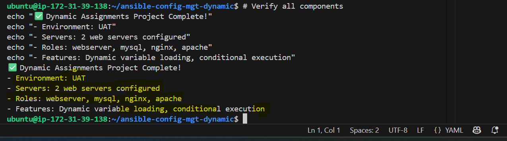

# Dynamic Ansible Roles Project

## Project Overview
This project demonstrates the implementation of dynamic assignments in Ansible, enabling environment-specific configurations and conditional role execution. The project builds upon static assignments to create a flexible, scalable infrastructure-as-code solution with MySQL database integration and load balancer capabilities.

## Architecture Components
- **Jenkins CI/CD Server** - Automation and artifact management
- **Ansible Configuration Management** - Infrastructure as Code with dynamic assignments
- **UAT Web Servers** - 2 RHEL 8 instances for testing
- **MySQL Database Role** - Production-ready database configuration
- **Load Balancer Roles** - Nginx and Apache with conditional execution
- **Dynamic Variable Loading** - Environment-specific configuration management


## Implementation Steps

### Step 1: Create Project Directory Structure

Create the complete directory structure for dynamic assignments with all required folders and files.

```bash
# Create main project directory
mkdir ansible-config-mgt-dynamic && cd ansible-config-mgt-dynamic

# Create directory structure
mkdir -p {dynamic-assignments,env-vars,inventory,playbooks,static-assignments}
mkdir -p roles/{webserver,mysql,nginx,apache}/{tasks,defaults,handlers,templates,meta}
```

![Project Directory Structure]


### Step 2: Install and Configure MySQL Role

Install the production-ready MySQL role from Ansible Galaxy and configure it for the tooling website database requirements.

```bash
# Initialize git repository
git init
git branch roles-feature
git checkout roles-feature

# Install MySQL role from Ansible Galaxy
ansible-galaxy install geerlingguy.mysql -p ./roles/

# Rename the role for consistency
mv ./roles/geerlingguy.mysql ./roles/mysql
```

![List of All Roles]


### Step 3: Create Dynamic Variable Loading

Configure the dynamic assignments system to automatically load environment-specific variables based on the deployment target.

```bash
# Create dynamic assignments file
cat > dynamic-assignments/env-vars.yml << 'EOF'
---
- name: collate variables from env specific file, if it exists
  hosts: all
  tasks:
    - name: looping through list of available files
      include_vars: "{{ item }}"
      with_first_found:
        - files:
            - dev.yml
            - stage.yml
            - prod.yml
            - uat.yml
          paths:
            - "{{ playbook_dir }}/../env-vars"
      tags:
        - always
EOF

# Create UAT environment variables
cat > env-vars/uat.yml << 'EOF'
---
env_name: "uat"
server_name: "uat-webserver"
document_root: "/var/www/html"
db_host: "172.31.35.100"
testing_mode: true
debug_mode: false
load_balancer_is_required: true
enable_nginx_lb: true
enable_apache_lb: false
EOF
```

![Dynamic Assignment Configuration]


![Environment Variable Configuration]


### Step 4: Configure Load Balancer Roles

Create conditional load balancer roles that can be enabled or disabled based on environment requirements.

```bash
# Create load balancer static assignment
cat > static-assignments/loadbalancers.yml << 'EOF'
---
- hosts: lb
  roles:
    - { role: nginx, when: enable_nginx_lb and load_balancer_is_required }
    - { role: apache, when: enable_apache_lb and load_balancer_is_required }
EOF
```
![Static Assignment Load Balancer Configuration]


### Step 5: Create Main Site Playbook

Configure the main site.yml playbook to orchestrate dynamic variable loading and conditional role execution.

```bash
# Create main site playbook
cat > playbooks/site.yml << 'EOF'
---
- name: Load environment variables
  import_playbook: ../dynamic-assignments/env-vars.yml

- name: Configure webservers
  hosts: uat_webservers
  roles:
    - webserver

- name: Configure load balancers
  hosts: lb
  roles:
    - role: nginx
      when: enable_nginx_lb | default(false)
    - role: apache
      when: enable_apache_lb | default(false)
EOF
```

![Main Site Playbook Configuration]


### Step 6: Configure UAT Inventory

Set up the inventory file with your actual UAT server IP addresses for deployment testing.

```bash
# Create UAT inventory
cat > inventory/uat << 'EOF'
[uat_webservers]
web1-uat ansible_host=172.31.35.171 ansible_ssh_user=ec2-user
web2-uat ansible_host=172.31.36.77 ansible_ssh_user=ec2-user

[lb]
lb-uat ansible_host=172.31.35.100 ansible_ssh_user=ec2-user

[all:vars]
ansible_ssh_private_key_file=~/.ssh/oregon-keypair.pem
ansible_ssh_common_args='-o StrictHostKeyChecking=no'
EOF
```

![UAT Inventory Configuration]


### Step 7: Deploy to UAT Environment

Execute the complete deployment to UAT environment, demonstrating dynamic variable loading and role execution.

```bash
# Test connectivity to UAT servers
ansible all -i inventory/uat -m ping

# Deploy to UAT environment
ansible-playbook -i inventory/uat playbooks/site.yml -e "environment=uat"
```

![Success Deploying to UAT Environment]


### Step 8: Verify Apache Service Status

Confirm that Apache web server is properly installed, configured, and running on all UAT web servers.

```bash
# Verify Apache service status on UAT servers
ansible uat_webservers -i inventory/uat -m shell -a "systemctl status httpd"

# Check Apache process
ansible uat_webservers -i inventory/uat -m shell -a "ps aux | grep httpd"
```

![Apache Running on UAT Server]


### Step 9: Verify All Components

Perform comprehensive verification of all deployed components including web servers, roles, and configurations.

```bash
# Verify all components are working
ansible-playbook -i inventory/uat playbooks/site.yml -e "environment=uat" --check

# Check role execution summary
ansible uat_webservers -i inventory/uat -m setup -a "filter=ansible_hostname"

# Verify environment-specific variables are loaded
ansible uat_webservers -i inventory/uat -m debug -a "var=env_name"
```

![Verifying All Components]


---
## Project Benefits

### Flexibility and Scalability
- **Environment-Specific Configuration**: Different settings per environment (dev, staging, UAT, production)
- **Conditional Execution**: Run different tasks and roles based on environment requirements
- **Variable Precedence**: Override default values with environment-specific configurations
- **Easy Environment Addition**: Simple process to add new environments

### Maintainability and Organization
- **Centralized Configuration**: All environment variables managed in dedicated files
- **Reduced Duplication**: Reuse playbooks and roles across multiple environments
- **Clear Separation**: Environment-specific logic separated from core infrastructure code
- **Modular Architecture**: Independent, reusable components

### Production Readiness
- **Industry Standards**: Uses production-tested MySQL role from Ansible Galaxy
- **Load Balancer Options**: Flexible choice between Nginx and Apache
- **Automated Deployments**: Ready for CI/CD pipeline integration
- **Error Handling**: Robust conditional logic and fallback mechanisms

## Environment Configuration Examples

### UAT Environment
- **Purpose**: User Acceptance Testing
- **Configuration**: Testing mode enabled, performance monitoring active
- **Load Balancer**: Nginx enabled
- **Database**: Shared development database

### Production Environment
- **Purpose**: Live production workloads
- **Configuration**: SSL enabled, backup enabled, minimal logging
- **Load Balancer**: Apache with advanced configurations
- **Database**: Dedicated production database with security hardening

## Usage Instructions

### Deploy to Different Environments
```bash
# Deploy to UAT
ansible-playbook -i inventory/uat playbooks/site.yml -e "environment=uat"

# Deploy to Production (when ready)
ansible-playbook -i inventory/prod playbooks/site.yml -e "environment=prod"

# Deploy with specific load balancer
ansible-playbook -i inventory/uat playbooks/site.yml -e "environment=uat enable_nginx_lb=true"
```

## Repository Information
- **Repository**: https://github.com/anyanpee/dynamic-ansible-roles--project.git
- **Branch Strategy**: Feature branches for development, main branch for stable releases
- **CI/CD Ready**: Compatible with Jenkins automation pipelines

## Author
Peter Anyankpele

## License
This project is for educational and demonstration purposes.
